## Diagrama de clases
secucnia, procesos, clases
---
>**Usuarios de DB, nosql**
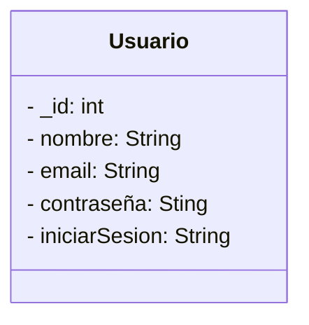

>**entidad relacion**
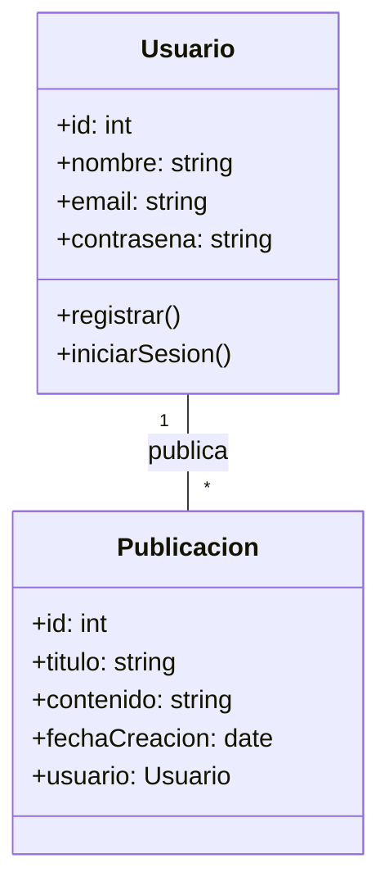

## Diagrama casos de uso
>**Para Inicio de sesion**

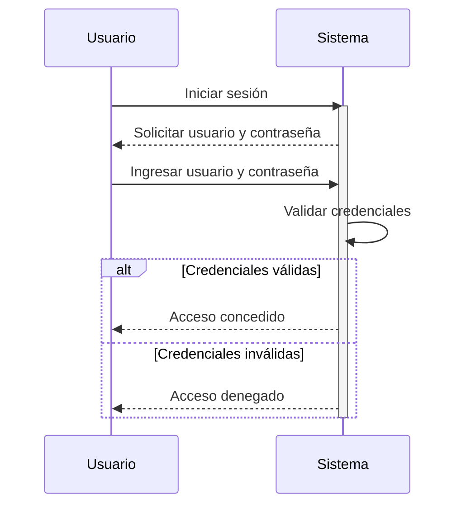

>**para iniciar una compra**
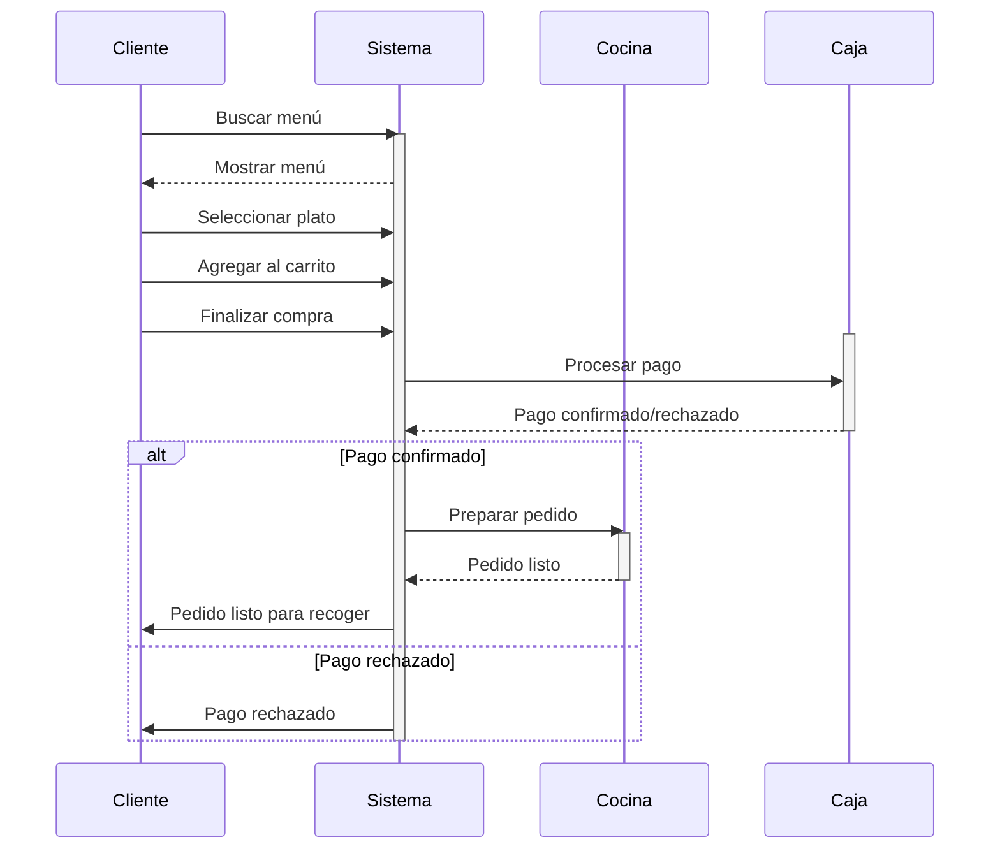

>**para iniciar una reserva**
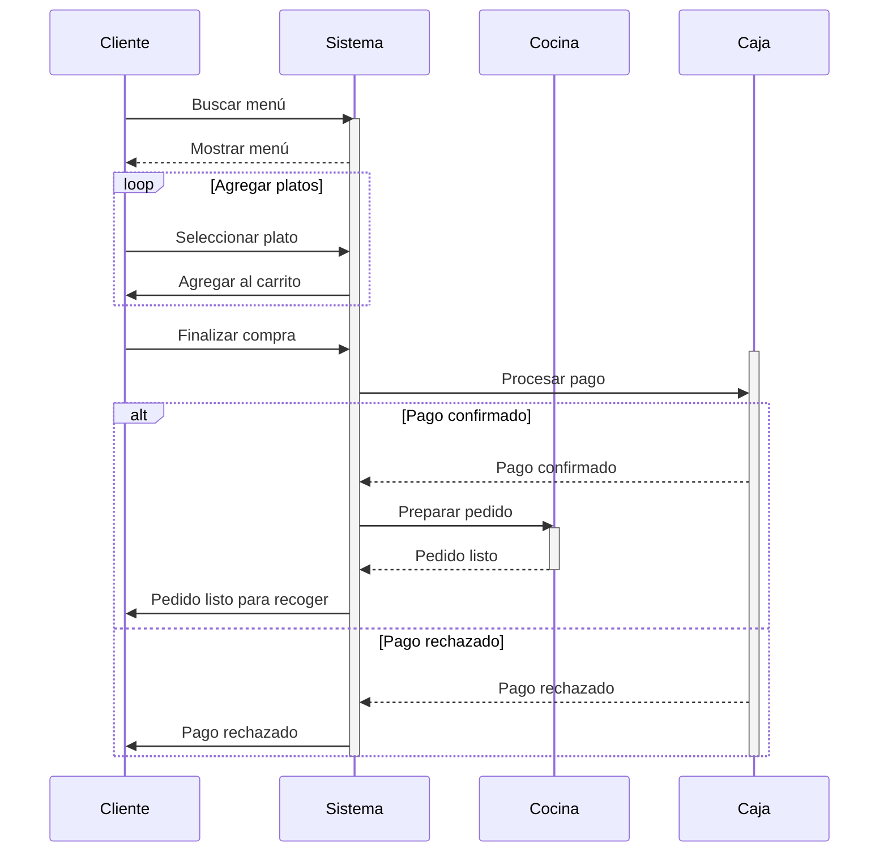
>**para gestion de menu**
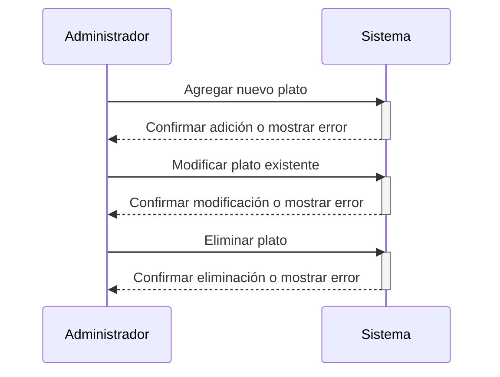
>**para gestion de reservas**
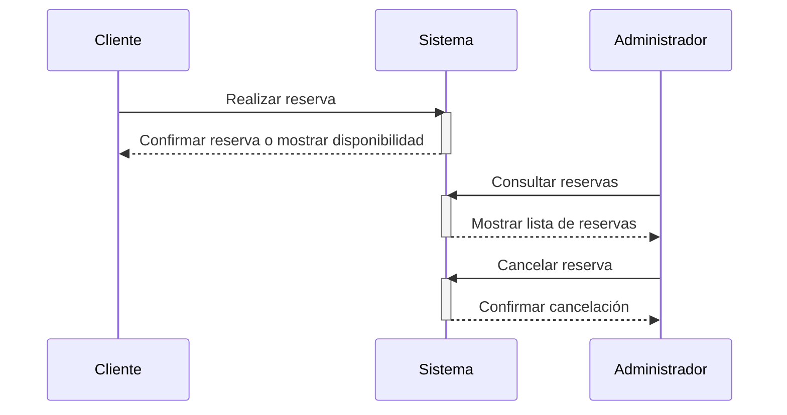

## Diagrama de secuencia

>**para la utenticaion dcon emai**
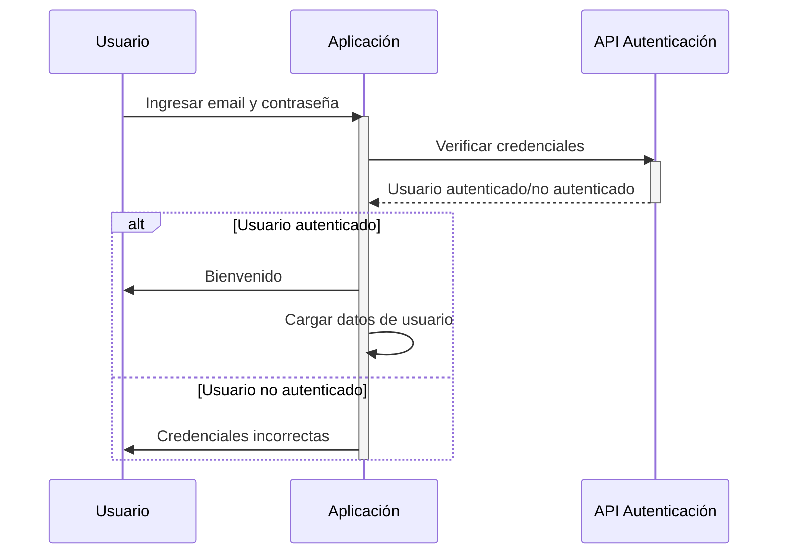
---
# Segundo Sprint
 
 

---
#### Diagramas de secuencia.
>**Para el registro de usuarios**
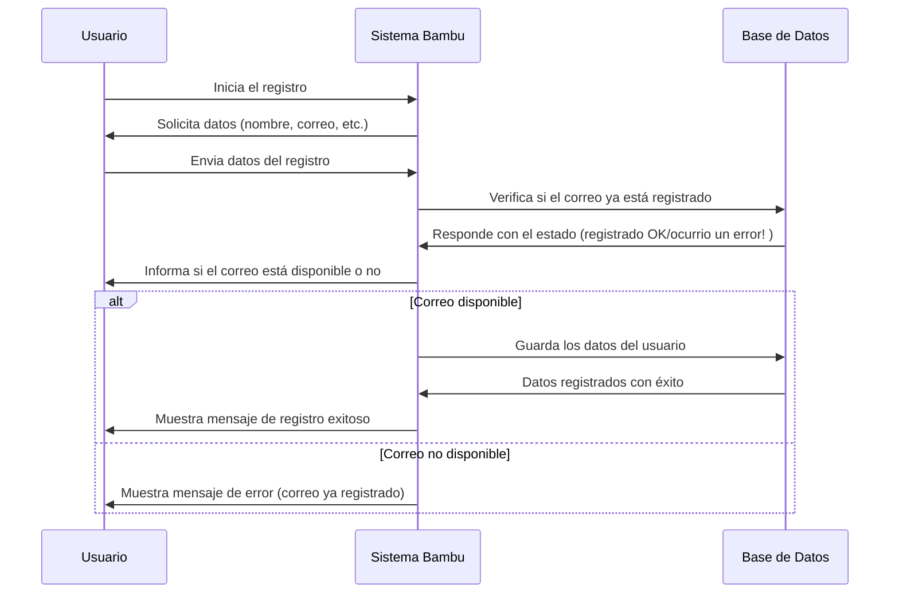
>**Para la pasarela de pagos**
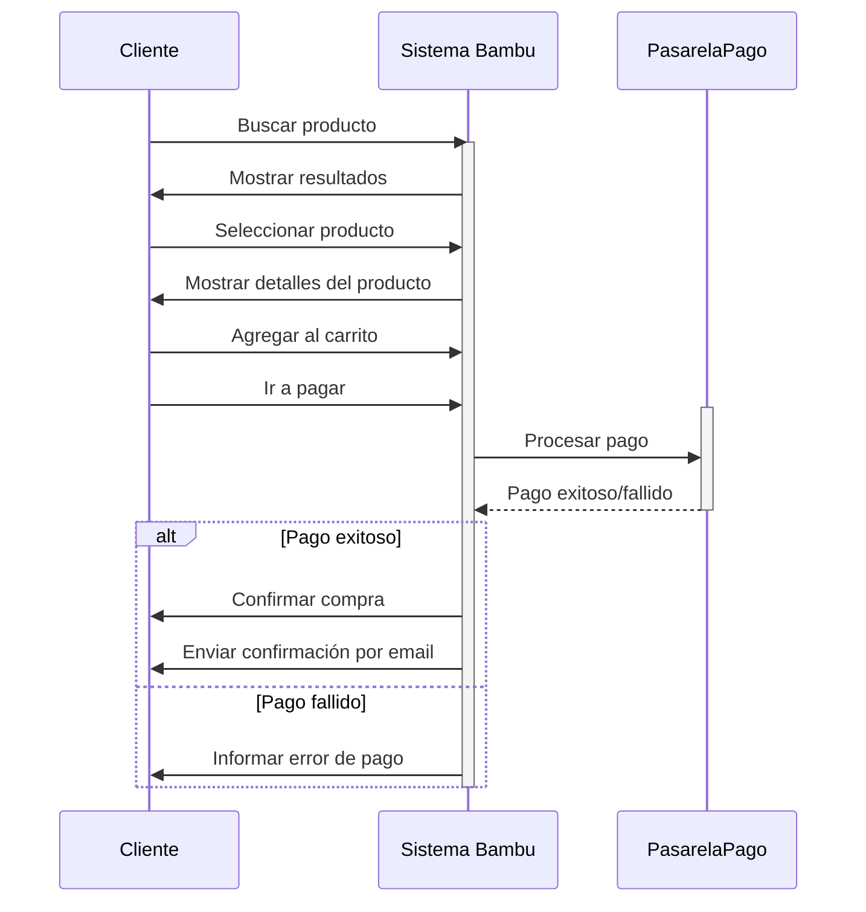
>**Para la verificacion del pago**
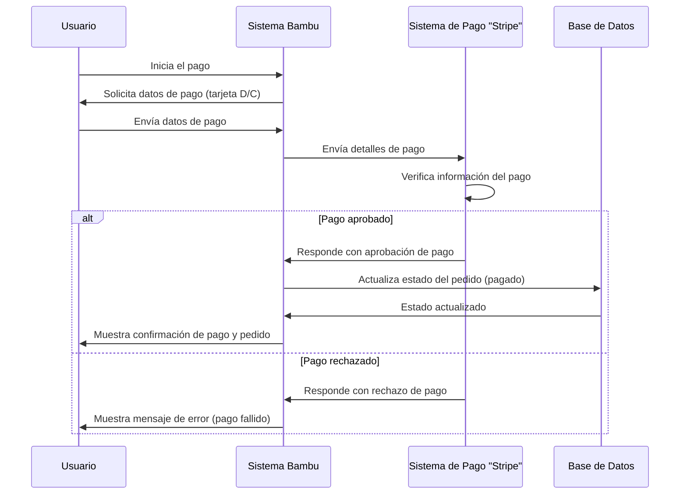

>**Para el proceso de compra de comida**
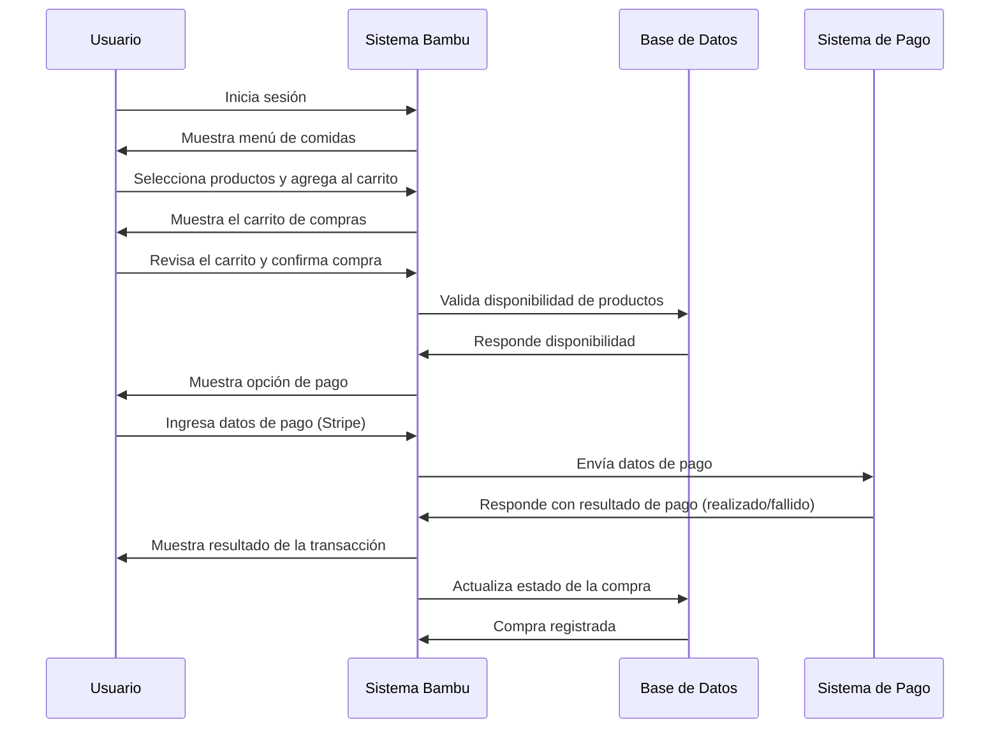

---
# Para el Quinto Hito - Analisi y Diseño II
 

>**Diagrama de secucnia: para registro e inicio de sesion, antes de pedir un plato.**
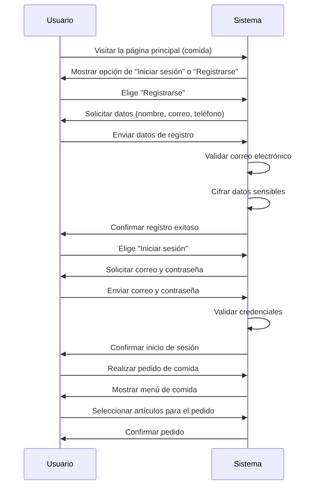

>**Diagrama de secucnia: para el contacto del WhatsApp**
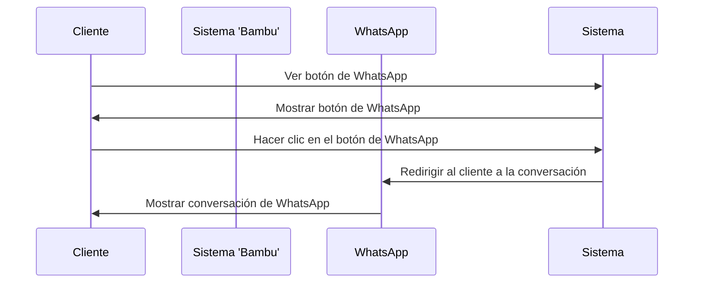

