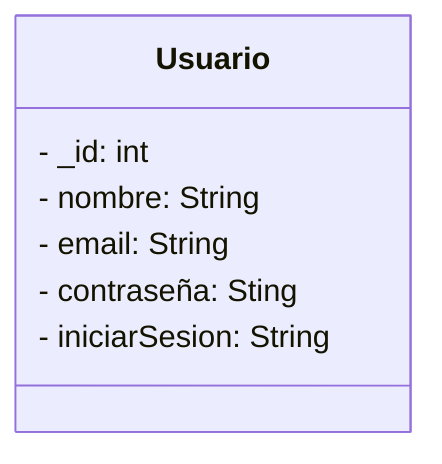
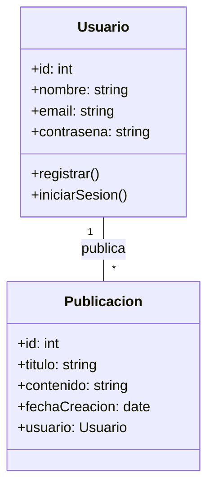
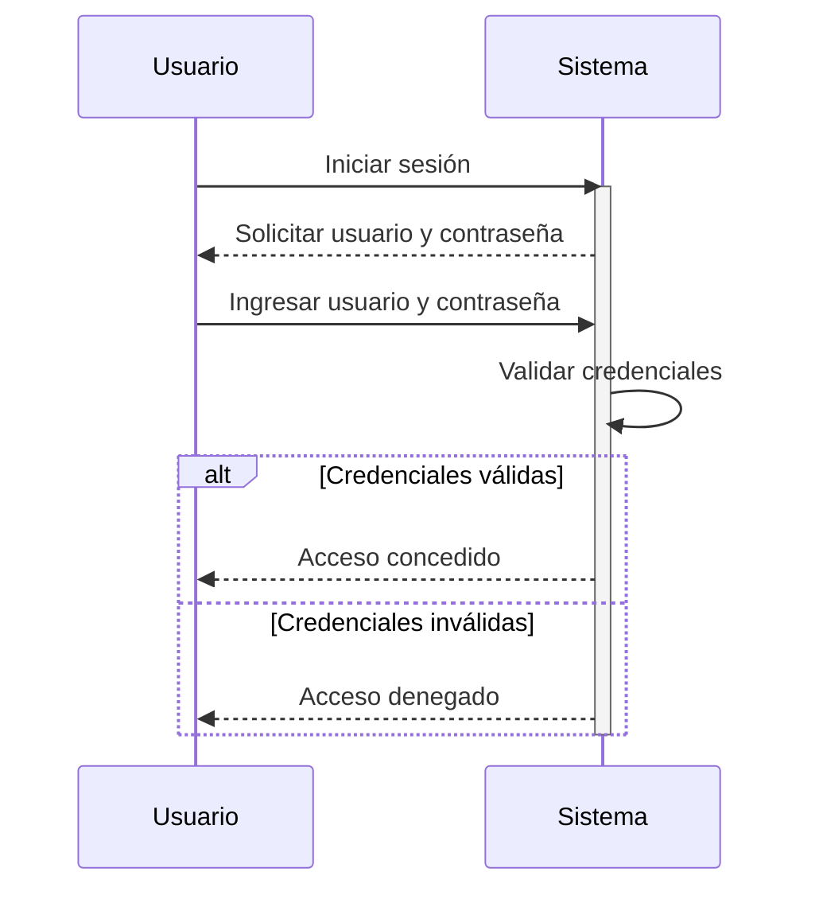
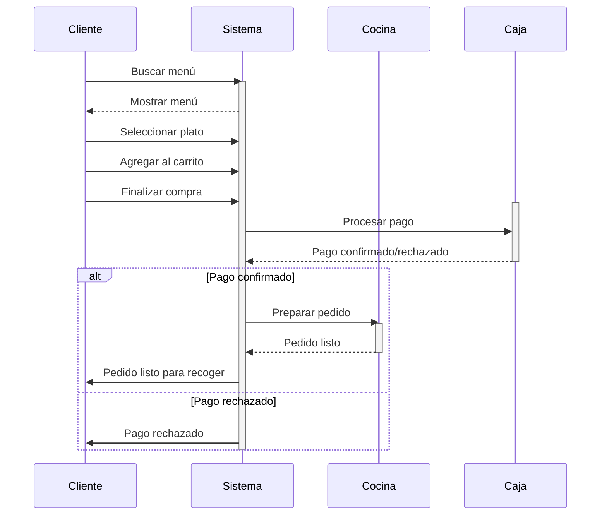
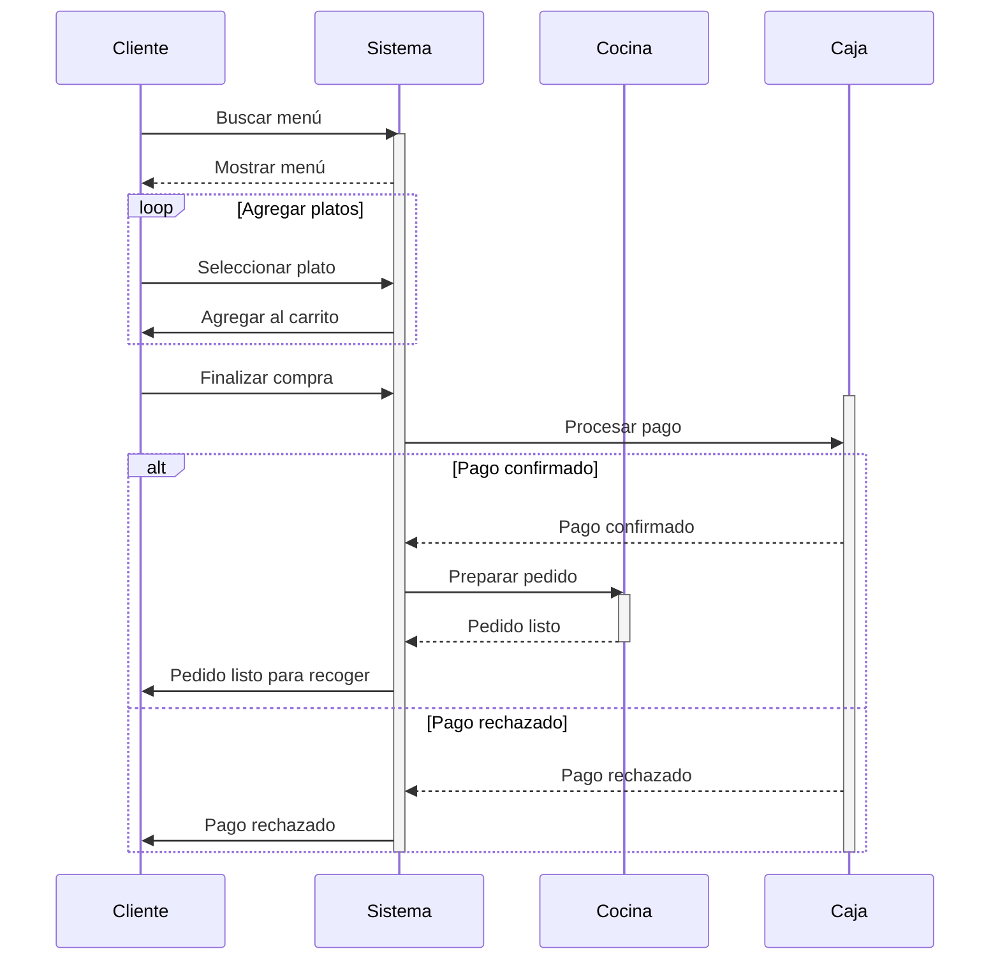
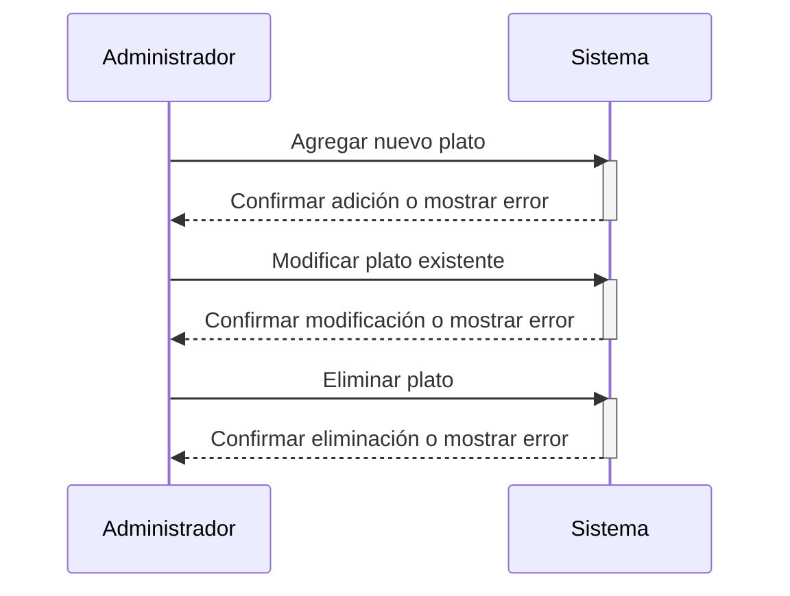
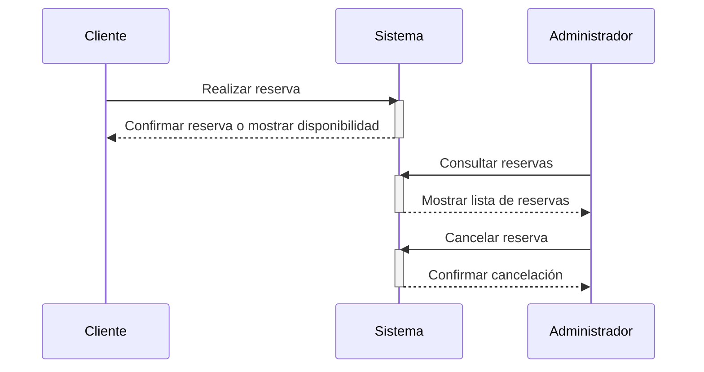
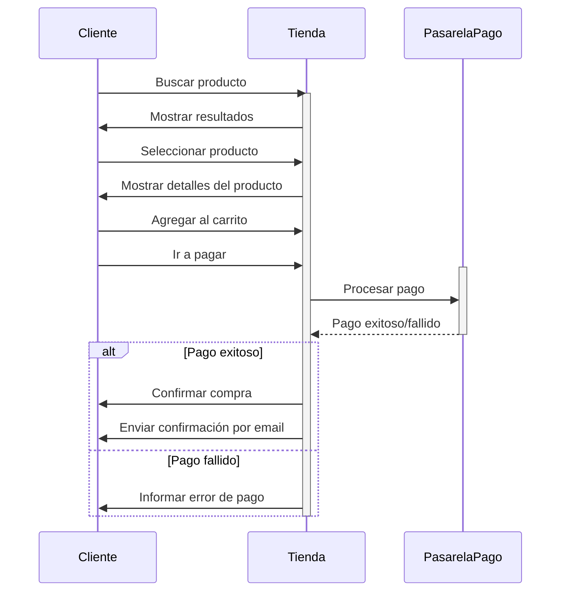
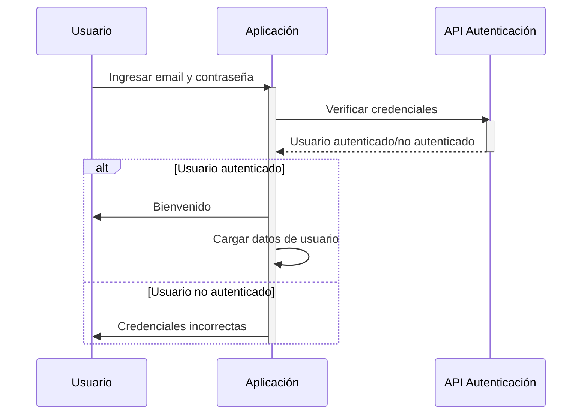

## Diagrama de clases

>**Usuarios de DB, nosql**

>**entidad relacion**

## Diagrama casos de uso
>**Para Inicio de sesion**

>**para iniciar una compra**

>**para iniciar una reserva**

>**para gestion de menu**

>**para gestion de reservas**

## Diagrama de secuencia

>**para la utenticaion dcon emai**
